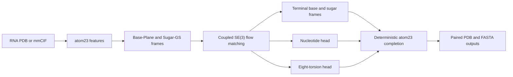

# DuetRNA

**Base-and-Sugar Dual-Frame Flow Matching for RNA Co-Design**

[Paper (OpenReview)](https://openreview.net/forum?id=61lWd2AwK6) ·
[Code](https://github.com/XjunLi/DuetRNA)

DuetRNA is an unconditional, length-controlled RNA co-design model. Given a
target chain length, it jointly generates a nucleotide sequence and a
three-dimensional heavy-atom structure. Each nucleotide is represented by two
coupled rigid frames: a nucleobase frame for inter-residue organization and a
sugar frame for backbone realization.

This repository is the complete artifact-clean code release. It contains data
preprocessing, dual-frame feature construction, training, optimizer-resumable
checkpoints, generation, the paper's inverse-folded-sequence (IF) and
generated-sequence (GS) evaluation protocols, and extended geometry,
diversity, novelty, and equivariance analyses. It does not contain datasets,
model weights, generated samples, experimental results, or cluster-specific
launch scripts.

## Method

RNA base interactions and sugar-phosphate geometry impose different demands on
a residue coordinate frame. DuetRNA assigns both of the following to every
nucleotide:

- **Base-Plane frame:** centered on the glycosidic connection atom (N9 for
  purines and N1 for pyrimidines), with orientation defined by the fitted base
  plane and an in-plane chemical axis.
- **Sugar-GS frame:** centered on C4′ and constructed by Gram-Schmidt
  orthogonalization from O4′, C4′, and C3′.

For a chain of length `N`, the continuous state lies on
`(SE(3) × SE(3))^N`. Translations follow linear interpolation and rotations
follow geodesics on `SO(3)`. A shared geometric trunk predicts terminal base
and sugar frames. A relative-pose objective supervises their within-nucleotide
base-to-sugar transform. Sequence and eight-torsion heads then complete an
atom23 representation with at most 23 heavy-atom slots per nucleotide;
hydrogens are not generated.



This is joint generation rather than sequence-conditioned structure
prediction: the sequence is an output of the same sampling process as the
structure.

## Paper-reported results

The manuscript reports the following RNASolo results on the RNA-FrameFlow
length grid (40–150 nt at intervals of 10, 50 samples per length, 600 total).
These values are paper results, not outputs bundled with this repository.

| Protocol | Sequence used for forward folding | Evaluator | scTM validity |
| --- | --- | --- | ---: |
| IF | gRNAde inverse-folded sequence | RhoFold | 48.67% |
| GS | DuetRNA's generated sequence | RhoFold | 38.83% |

The paper also reports 34.67% IF validity for a sugar-only ablation and 30.00%
when relative-pose supervision is removed. Direct coordinate analysis shows
improved steric packing, sugar-ring closure, and typical phosphodiester
geometry, while reduced novel-fold coverage and glycosidic-linkage accuracy
remain limitations.

Do not compare IF and GS numbers as if they were the same endpoint. IF asks
whether an external inverse folder can find a sequence for a generated
structure; GS tests the sequence generated by DuetRNA itself. Exact
reproduction additionally requires the corresponding DuetRNA checkpoint,
dataset snapshot and split, external checkpoints, evaluator versions, sample
grid, and random seeds.

## Code layout

The model code and `pyproject.toml` live at the repository root. Website and
outreach materials are grouped in `publicity/`. A local `Docs/` directory may
hold working notes; these are not part of the published code release.

| Directory | Contents |
| --- | --- |
| `duetrna/` | Training and generation entrypoints, interpolation/sampling, and training callbacks |
| `duetrna/configs/` | The single set of training and inference defaults |
| `duetrna/data/` | PDB/mmCIF preprocessing, structure parsers, datasets, batching, and feature transforms |
| `duetrna/models/` | Flow network, embeddings, IPA and torsion layers, training losses, and reconstruction |
| `duetrna/chemistry/` | Atom names, nucleotide/protein constants, residue encodings, and torsions |
| `duetrna/geometry/` | Rigid transformations, dual frames, coordinate alignment, SO(3), and atom reconstruction primitives |
| `benchmark/` | IF/GS self-consistency, diversity, novelty, and coordinate evaluation |
| `benchmark/protocols/` | IF and GS protocol presets |
| `benchmark/base_relationship/` | Base frames, interaction annotations, references, and comparison metrics |
| `benchmark/checkpoints/` | Instructions for separately obtained RhoFold weights |
| `evaluation_analysis/` | Extended structure-quality, diversity/novelty, and SE(3) analyses |
| `external_tools/grnade_api/` | gRNAde inverse-folding adapter; `src/` contains its network/layers, `src/data/` its featurization, and `checkpoints/` weight instructions |
| `external_tools/rhofold_api/rhofold/` | RhoFold configuration and inference; `model/` contains its network, `model/rna_fm/` the RNA-FM sequence encoder, and `utils/` feature/geometry helpers |
| `LICENSES/` | Third-party license texts |
| `publicity/` | Project website, blog, and outreach materials |

### Data preparation and loading

All DuetRNA data code lives in `duetrna/data/`. Raw datasets may be stored in
the separate, untracked top-level `data/` directory or at an external path.
Chemistry constants and geometry operations live in `duetrna/chemistry/` and
`duetrna/geometry/`. The model uses these directly without importing dataset
parsers or pickle-loading utilities.

| File in `duetrna/data/` | Role |
| --- | --- |
| `process_rna_pdb_files.py` | Convert RNASolo/PDB files to feature pickles and a metadata CSV |
| `process_rna3db_mmcif_files.py` | Convert RNA3DB mmCIF chains and record missing/extra chains |
| `parsing.py` | Read structures, classify chains, and assemble atom features and metadata |
| `features.py` | Read/write feature pickles, pad arrays, and assemble processed chain features |
| `io.py` | Read FASTA and split manifests, and write generated PDB structures |
| `dataset.py` | Filter metadata, load features, group samples by length, and construct DataLoaders |
| `data_transforms.py` | Turn atom features into dual-frame and torsion training targets |

The data path is: PDB/mmCIF files → feature pickles plus metadata CSV →
dataset filtering and feature transforms → batched model inputs.

The release intentionally excludes:

- RNASolo, RNA3DB, or any other dataset or metadata dump;
- DuetRNA, gRNAde, or RhoFold checkpoints and weights;
- generated PDB/FASTA files, metrics, plots, logs, and reports;
- experiment plans, result tables, scratch notebooks, and temporary tests; and
- server, scheduler, job-array, deployment, or private run-configuration
  scripts.

## Installation

The maintained environment uses Python 3.11 and PyTorch 2.4.x. A CUDA GPU is
recommended for training and generation. The bundled RNA-FrameFlow-compatible
EvalSuite currently requires CUDA for RhoFold evaluation. Install the PyTorch
and PyTorch Geometric wheels matching your CUDA runtime before the repository
itself; `torch-scatter` and `torch-cluster` must match the installed PyTorch
build.

```bash
git clone https://github.com/XjunLi/DuetRNA.git
cd DuetRNA

python3.11 -m venv .venv
source .venv/bin/activate
python -m pip install --upgrade pip

# Install the platform-appropriate PyTorch 2.4.x and PyG extension wheels first.
# See https://pytorch.org/get-started/locally/ and https://data.pyg.org/whl/.
python -m pip install -e .
```

Run all commands below from the repository root; configuration and
external-artifact paths are relative to it.

Verify that the full stack imports:

```bash
python - <<'PY'
from duetrna.models.flow_module import DuetRNAFlowModule
from duetrna.train import DuetRNATrainer
from duetrna.inference import DuetRNASampler
from benchmark.evalsuite import DuetRNAEvalSuite
print("DuetRNA full pipeline is importable")
PY
```

## Data preparation

No data are downloaded automatically. Keep raw and processed data outside Git,
and record the exact dataset release used for a run.

### RNASolo PDB files

The primary paper training uses the historical RNASolo snapshot dated
2023-10-31. After obtaining and extracting its PDB files, run:

```bash
python -m duetrna.data.process_rna_pdb_files \
  --pdb_dir /absolute/path/to/rnasolo/pdb \
  --write_dir /absolute/path/to/rnasolo_processed \
  --num_processes 16
```

The processor writes per-structure pickles and
`/absolute/path/to/rnasolo_processed/rna_metadata.csv`. Pass that CSV to
training with a Hydra override; no dataset path is hard-coded into the model.

### RNA3DB mmCIF files

This optional converter accepts RNA3DB mmCIF files and produces the same
feature-pickle and metadata-CSV format consumed by the training data loader.
Dataset-specific handling is confined to preprocessing; training and
inference use the same entrypoints and configuration.

```bash
python -m duetrna.data.process_rna3db_mmcif_files \
  --mmcif_dir /absolute/path/to/rna3db-mmcifs \
  --filter_json /absolute/path/to/filter.json \
  --cluster_json /absolute/path/to/cluster.json \
  --split_json /absolute/path/to/split.json \
  --write_dir /absolute/path/to/rna3db_processed \
  --metadata_path /absolute/path/to/rna3db_metadata.csv \
  --missing_manifest_path /absolute/path/to/rna3db_missing.csv \
  --extra_manifest_path /absolute/path/to/rna3db_extra.csv \
  --num_processes 16
```

The RNA3DB processor records missing and extra chain manifests rather than
silently changing the official filtered cohort.

## Default configuration

`duetrna/configs/config.yaml` and `duetrna/configs/inference.yaml` are the
single training and inference configuration pair. Their defaults are the
current RNASolo settings. To use another processed dataset, override the
data paths; there is no separate model package or training configuration.

| Setting | Default |
| --- | --- |
| Length filter | 40–150 nt |
| Base frame | Base-Plane, connection-atom origin |
| Sugar frame | Sugar-GS, C4′ origin |
| Pose conditioning | `none` |
| Self-conditioning probability | 0.5 |
| Model depth | 6 coupled geometric blocks |
| Sequence loss weight | 1.0 |
| Torsion and atom reconstruction weights | 1.0 |
| Soft base-template auxiliary | 0.5 |
| Adjacent-chain auxiliary | 1.0 |
| Steric clash auxiliary | 5.0, excluding immediate sequence neighbors |
| Optimizer | AdamW, learning rate `1e-4` |
| Training | 4-device DDP, `32-true`, 3,844 epochs |
| Recovery snapshots | Every 641 epochs plus guarded normal-train-end snapshot |
| Generation sampler | 100 integration points, rotation exponent 20 |

The default sampler uses 100 integration points and rotation exponent 20.

The current training and validation datasets are selected from the same CSV.
Validation output from this default configuration is therefore an in-training
diagnostic, not a held-out benchmark claim. Formal evaluation requires a
separately documented cohort and protocol.

## Training

Run training from the `DuetRNA/` code directory:

```bash
python duetrna/train.py \
  data_cfg.csv_path=/absolute/path/to/rnasolo_processed/rna_metadata.csv
```

Useful public overrides include:

```bash
# Change the number of visible training devices.
python duetrna/train.py \
  data_cfg.csv_path=/absolute/path/to/rna_metadata.csv \
  experiment.num_devices=2

# One-step CPU engineering smoke test; this is not a scientific benchmark.
python duetrna/train.py \
  data_cfg.csv_path=/absolute/path/to/rna_metadata.csv \
  experiment.debug=true \
  experiment.trainer.accelerator=cpu \
  experiment.num_devices=1 \
  experiment.trainer.max_steps=1 \
  data_cfg.num_workers=0 \
  data_cfg.val_num_workers=0
```

The default W&B mode is offline. Checkpoints and the resolved `config.yaml` are
written below the configured `experiment.checkpointer.dirpath`.

### Resume training

Resume with the Lightning checkpoint rather than loading model weights alone;
this restores optimizer, scheduler, loop, and global-step state:

```bash
python duetrna/train.py \
  data_cfg.csv_path=/absolute/path/to/rna_metadata.csv \
  experiment.warm_start=/absolute/path/to/epoch-checkpoint.ckpt
```

Keep the dataset snapshot, resolved configuration, checkpoint file, and
software revision together. Changing the architecture or a scientific loss
definition requires a matched retraining rather than silent partial loading.

## Generation

A DuetRNA checkpoint is required. Its directory must also contain the resolved
training configuration. The public training entrypoint writes `config.yaml`
automatically. A checkpoint copied from the research tree may instead retain
one `config_*.yaml` file; inference accepts that unambiguous filename, or an
explicit `inference.training_config_path=/absolute/path/to/config.yaml`.

For checkpoints in `step_snapshots/` or `final_snapshot/`, the training
configuration stays in the parent checkpoint directory. Set
`inference.training_config_path=/absolute/path/to/checkpoint/config.yaml`
when generating from one of those snapshots.

Generate four length-80 designs without running evaluation:

```bash
python duetrna/inference.py \
  inference.ckpt_path=/absolute/path/to/checkpoint/duetrna.ckpt \
  inference.output_dir=/absolute/path/to/generated \
  inference.name=length80 \
  inference.samples.length_subset='[80]' \
  +inference.samples.samples_per_length=4 \
  inference.evalsuite.run_eval=false
```

The leading `+` adds `samples_per_length` before the benchmark preset is
merged, so the command-line value takes precedence.

For a CPU-only engineering smoke test, add:

```text
inference.use_gpu=false inference.num_gpus=0
```

Each design produces:

```text
generated/length80/length_80/
├── sample_0.pdb
├── sample_0.fasta
└── sample_0_traj.pdb
```

The PDB and FASTA are paired outputs from the same joint sample. The trajectory
PDB stores atom23 coordinates across integration steps. Generation is
deterministically seeded per `(length, sample_id)` so device assignment does not
change a sample's initial noise.

Without `length_subset`, the paper preset generates 50 samples at each length
from 40 through 150 in steps of 10.

## Paper benchmark evaluation

The benchmark source is included, but external weights and compiled comparison
programs are intentionally not redistributed.

### Required external artifacts

Place the following files at the paths expected by the default configuration:

```text
benchmark/checkpoints/RhoFold_pretrained.pt
external_tools/grnade_api/checkpoints/gRNAde_ARv1_1state_all.h5
external_tools/cpp/USalign
external_tools/cpp/qTMclust
external_tools/cpp/TMscore
```

- Obtain `RhoFold_pretrained.pt` from the same
  [CUHK checkpoint endpoint](https://proj.cse.cuhk.edu.hk/aihlab/RhoFold/api/download?filename=RhoFold_pretrained.pt)
  specified by RNA-FrameFlow. Keep this endpoint and filename for
  RNA-FrameFlow-compatible evaluation.
- The bundled IF adapter matches the gRNAde v0.3 benchmark checkpoint named
  `gRNAde_ARv1_1state_all.h5`, available from the
  [upstream v0.3.2 checkpoint directory](https://github.com/chaitjo/geometric-rna-design/tree/v0.3.2/checkpoints).
- Obtain US-align, qTMclust, and TMscore from RNA-FrameFlow's
  [evaluation-tool directory](https://github.com/rish-16/rna-backbone-design/tree/main/rna_backbone_design/tools/cpp)
  and make each binary executable.

Dataset and compiled-tool paths under `inference.evalsuite.paths` can be
overridden when keeping those artifacts elsewhere. The bundled evaluator keeps
the RhoFold and gRNAde checkpoints at the fixed paths shown above to preserve
RNA-FrameFlow protocol alignment. Record the external source and version used
for a run.

### IF: structure-first self-consistency

The structure-first preset uses gRNAde to design sequences for each generated
structure and RhoFold to fold those sequences:

```bash
python duetrna/inference.py \
  inference.ckpt_path=/absolute/path/to/checkpoint/duetrna.ckpt \
  inference.output_dir=/absolute/path/to/generated \
  inference.name=paper_if \
  inference.benchmark_preset=benchmark/protocols/duetrna_structure_first.yaml \
  inference.evalsuite.run_eval=true
```

### GS: direct joint self-consistency

The joint preset folds the FASTA generated beside each DuetRNA PDB and does not
run inverse folding:

```bash
python duetrna/inference.py \
  inference.ckpt_path=/absolute/path/to/checkpoint/duetrna.ckpt \
  inference.output_dir=/absolute/path/to/generated \
  inference.name=paper_gs \
  inference.benchmark_preset=benchmark/protocols/duetrna_joint.yaml \
  inference.evalsuite.run_eval=true
```

### Evaluate an existing generation directory

Use the same output root/name and disable sampling:

```bash
python duetrna/inference.py \
  inference.run_inference=false \
  inference.ckpt_path=/absolute/path/to/checkpoint/duetrna.ckpt \
  inference.output_dir=/absolute/path/to/generated \
  inference.name=paper_gs \
  inference.benchmark_preset=benchmark/protocols/duetrna_joint.yaml \
  inference.evalsuite.run_eval=true
```

The benchmark reports folding-based self-consistency, coordinate metrics,
qTMclust diversity, and novelty. Its protocol constants are explicit in the
two YAML presets. Trajectory PDBs are excluded from final-sample denominators.

## Extended evaluation and auditing

`evaluation_analysis/` adds fail-closed, provenance-aware analyses for exact
denominators and direct coordinate quality.

1. Copy `evaluation_analysis/config.example.toml` and the two example case
   tables to local, untracked files.
2. Set the three roots used by the template:

   ```bash
   export DUETRNA_EVAL_DATA_ROOT=/absolute/path/to/evaluation_data
   export DUETRNA_EVAL_TOOLS_ROOT=/absolute/path/to/evaluation_tools
   export DUETRNA_EVAL_OUTPUT_ROOT=/absolute/path/to/evaluation_output
   ```

3. Export the exact post-filter training cohort used for exhaustive novelty:

   ```bash
   python -m evaluation_analysis.export_training_manifest \
     --model-config duetrna/configs/config.yaml \
     --data-root /absolute/path/to/data_root \
     --output /absolute/path/to/rnasolo_train_manifest.csv
   ```

4. Run the analyses:

   ```bash
   python -m evaluation_analysis.structure_quality \
     --config /absolute/path/to/config.toml

   python -m evaluation_analysis.diversity \
     --config /absolute/path/to/config.toml

   python -m evaluation_analysis.se3_equivariance \
     --config /absolute/path/to/config.toml

   # Structure quality followed by diversity in dependency order.
   python -m evaluation_analysis.run_all \
     --config /absolute/path/to/config.toml
   ```

The diversity analysis keeps every final generated PDB in the raw denominator
and reports all three quantities with counts:

- `D_raw = K(G) / |G|`: clusters among all generated samples;
- `D_valid = K(V) / |V|`: clusters conditioned on scTM-valid samples; and
- `Y_UV = K(V) / |G|`: unique-valid yield per generated sample.

Missing or failed self-consistency evaluations remain in `G` and cannot enter
`V`. Exhaustive novelty uses the maximum US-align `TM2` against every structure
in the exported training manifest.

Structure quality includes independent sugar pseudorotation, glycosidic χ,
RNA heavy-atom clash, sugar-ring, and chain-geometry measurements. Reported
Phenix/MolProbity values come only from actual `phenix.rna_validate` and
`phenix.clashscore` commands. If those executables are unavailable, the run
fails rather than substituting a different metric.

The base-relationship tools used for frame and interaction analysis are also
available:

```bash
python -m benchmark.base_relationship.cli --help
python -m benchmark.base_relationship.cli collect --help
python -m benchmark.base_relationship.cli build-reference --help
python -m benchmark.base_relationship.cli evaluate --help
```

## Release validation

Validation of the module consolidation and repository-root layout covered:

- Python compilation, internal import resolution, and dependency-cycle checks;
- comparison of moved functions/classes and numerical checks of frame geometry;
- real Hydra configuration resolution for script and module entrypoints, with
  the unavailable training dependencies replaced by test doubles;
- 23 dependency-light evaluation regression tests;
- wheel and source-distribution builds, package contents, and lightweight
  imports from the wheel; and
- preservation of training/inference configuration values and external-tool
  source files.

These checks do not replace full-stack validation. Real-PDB preprocessing,
model forward/backward passes, checkpoint numerical equivalence, optimizer
resume, CUDA/DDP execution, and evaluation with external model weights have
not been rerun for this layout refactor. Run those checks in the maintained
Python/PyTorch environment before claiming end-to-end reproducibility.

## Scientific scope and limitations

DuetRNA outputs computational designs, not experimentally validated RNAs.
Folding-based self-consistency and coordinate checks do not establish
biochemical function, cellular activity, safety, synthesizability, or
therapeutic value. Independent structural validation and wet-lab experiments
are required before biological claims.

The paper identifies checkpoint and seed sensitivity, lower novel-fold
coverage, and a localized glycosidic-linkage error. A complete experimental
validation, complete MolProbity characterization for every generated sample,
and functional design benchmark are outside the present scope.

## Citation

```bibtex
@inproceedings{li2026duetrna,
  title     = {Base-and-Sugar Dual-Frame Flow Matching for RNA Co-Design},
  author    = {Li, Junzhe and Peng, Lijian and Li, Yuhao and Zhou, Yize and
               Cao, Hanqun and Tan, Cheng and Liu, Shengchao},
  booktitle = {ICML 2026 Workshop on Generative AI and Biology},
  year      = {2026},
  url       = {https://openreview.net/forum?id=61lWd2AwK6}
}
```

Machine-readable metadata are provided in `CITATION.cff`.

## License and third-party software

See [LICENSE](LICENSE) for DuetRNA's MIT license. Adapted files retain the
licenses recorded in their headers and [THIRD_PARTY_NOTICES.md](THIRD_PARTY_NOTICES.md).
The corresponding license texts are in [LICENSES/](LICENSES/).

Model weights, datasets, Phenix, and compiled structural-comparison tools are
not covered by this repository's license and must be obtained under their own
terms.
